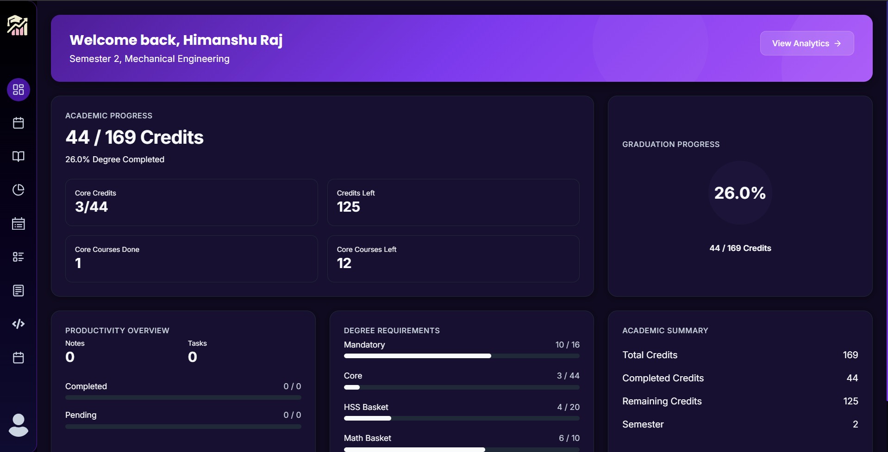
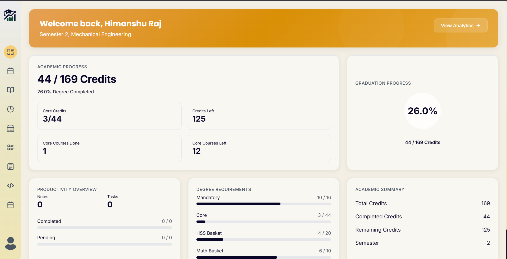
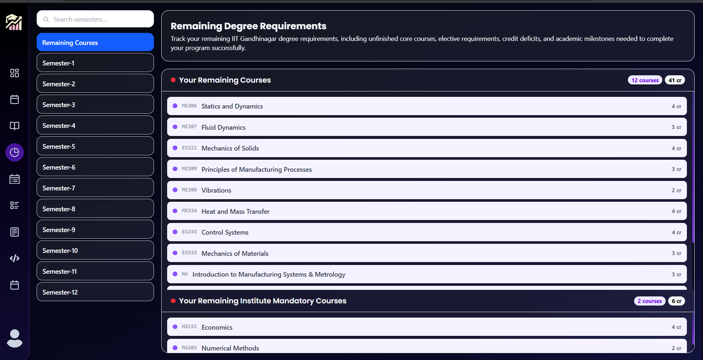
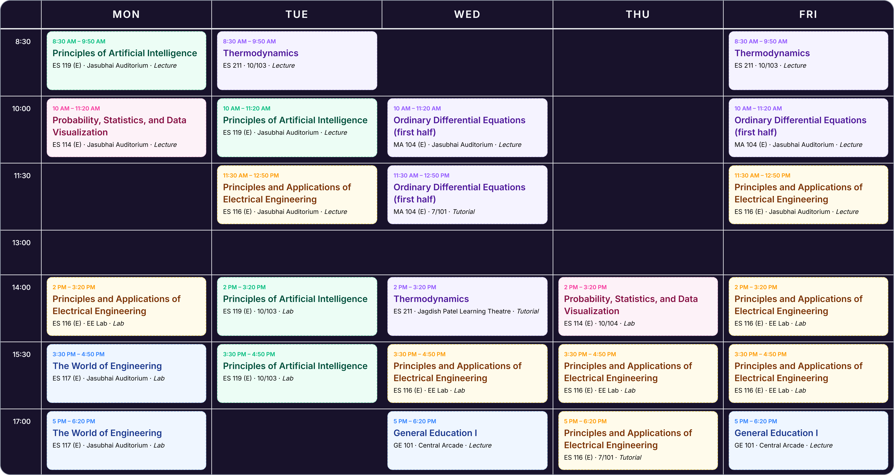
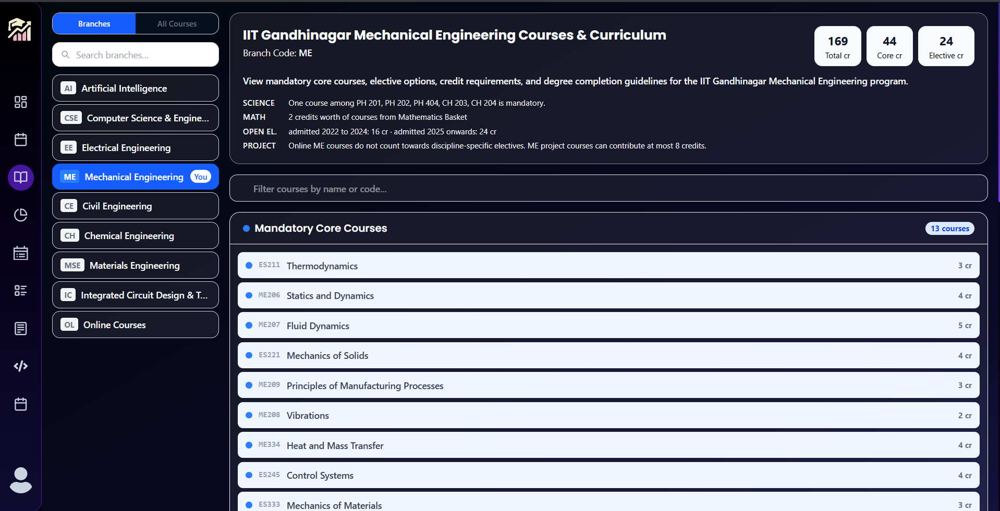
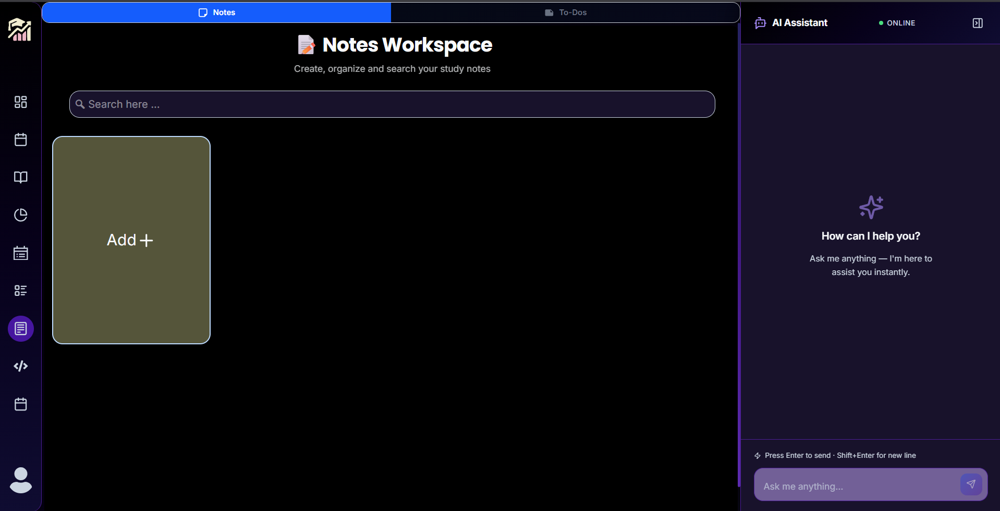
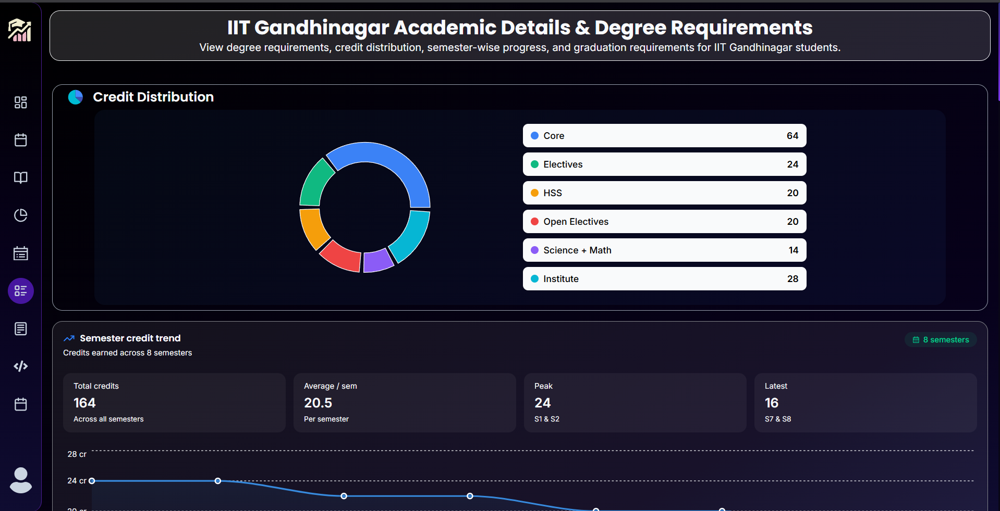
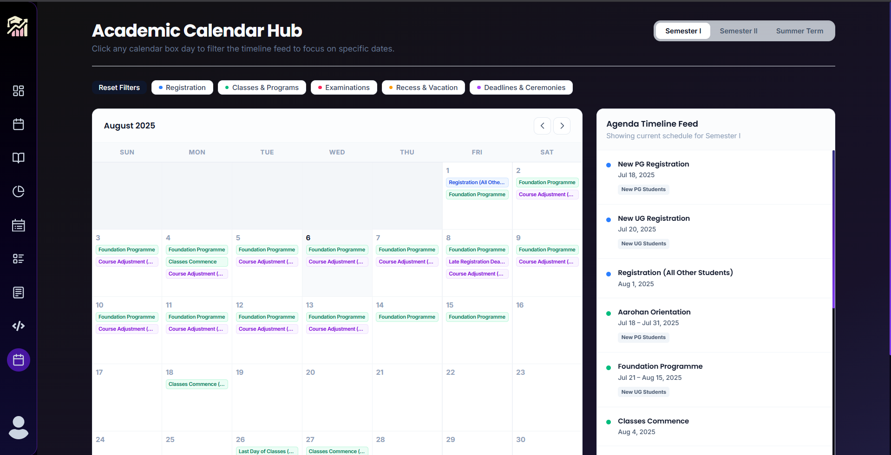

# StudyTracker

StudyTracker is a full-stack student productivity and academic management platform designed to help students organize their coursework, track academic progress, manage tasks, plan semesters, and visualize their performance through interactive analytics.

The platform combines course planning, academic tracking, timetable generation, notes management, productivity tools, and performance analytics into a single dashboard, providing students with a centralized workspace for their academic journey.

---


## Features

### Authentication & User Management

* Secure JWT-based authentication
* Google OAuth Login
* Persistent login sessions using HTTP-only cookies
* User profile management
* Role-based access control (Admin/User)

---

### Academic Dashboard

The dashboard provides a complete overview of a student's academic progress:

* Current CPI tracking
* Credit completion tracking
* Semester progress visualization
* Academic statistics cards
* Remaining degree requirement analysis
* Course completion overview
* Productivity metrics

---

### Course Management

Students can manage and track their courses efficiently:

* Browse all institute courses
* Branch-specific course recommendations
* Add completed courses
* Track course credits
* View course details and prerequisites
* Semester-wise course organization

---

### Semester Planner

A dedicated semester planning system that allows students to:

* Plan future semesters
* Organize courses semester-wise
* Estimate workload distribution
* Visualize academic roadmap
* Manage credit load across semesters

---

### Timetable Generator

Interactive timetable generation tool:

* Course slot selection
* Automatic conflict detection
* Weekly timetable visualization
* Schedule planning before registration
* Easy timetable customization

---

### Notes Management

Built-in note-taking system:

* Create, edit, and delete notes
* Multiple note themes
* Organized note management
* Quick access from dashboard
* Persistent cloud storage

---

### Todo Management

Productivity-focused task manager:

* Create and manage tasks
* Task prioritization
* Pinned tasks
* Deadline tracking
* Progress monitoring

---

### Academic Calendar Hub

A centralized academic calendar designed specifically for students to stay updated with institute events and deadlines.


* Full academic year calendar view
* Semester-wise calendar navigation
* Interactive agenda timeline feed
* Event filtering by category
* Registration
* Classes & Programs
* Examinations
* Recess & Vacations
* Deadlines & Ceremonies
* Day-wise event exploration
* Important academic deadlines tracking
* Semester I, Semester II, and Summer Term support
* Visual schedule management interface

### Analytics & Insights

Comprehensive academic analytics:

* Semester-wise performance charts
* Credit distribution analysis
* CPI trends
* Grade visualization
* Progress reports
* Interactive charts and graphs

---

### Competition Tracker

Stay updated with coding contests:

* Upcoming contest listings
* Contest schedule tracking
* Easy access to contest information
* Centralized competitive programming dashboard

---

### AI Academic Assistant

StudyTracker includes an AI-powered assistant that helps students with academic planning and productivity.


* AI-powered academic guidance
* Semester planning assistance
* Course selection recommendations
* Study planning suggestions
* Quick answers related to academics and coursework
* Personalized productivity insights

### Responsive Design

* Fully responsive UI
* Mobile-friendly experience
* Tablet support
* Desktop optimized layout
* Dark/Light theme support

---

## Tech Stack

### Frontend

* React
* TypeScript
* Vite
* Tailwind CSS
* React Router
* Recharts
* React Icons

### Backend

* Node.js
* Express.js
* MongoDB
* Mongoose
* JWT Authentication
* Google OAuth

### Security

* Helmet
* Cookie-based Authentication
* Protected Routes
* Input Validation
* MongoDB Sanitization

---

## Screenshots


### Dashboard




### Analytics



### Timetable Generator



### Course Overview



### Notes



### Details



---

### Calender



---

## Project Structure

```
StudyTracker
│
├── frontend
│   ├── src
│   ├── public
│   └── ...
│
├── backend
│   ├── controllers
│   ├── routes
│   ├── models
│   ├── middleware
│   └── ...
│
└── README.md
```

---

## Local Setup

### Prerequisites

* Node.js
* npm
* MongoDB Atlas or Local MongoDB

---

### Clone Repository

```bash
git clone <repository-url>
cd StudyTracker
```

---

## Backend Setup

Navigate to backend directory:

```bash
cd backend
npm install
```

Create a `.env` file:

```env
PORT=3000

MONGO_URL=your_mongodb_connection_string

CLIENT_URL=http://localhost:5173

JWT_SECRET=your_jwt_secret

OPENAI_API_KEY=your_openai_api_key

GOOGLE_CLIENT_ID=your_google_client_id

GOOGLE_CLIENT_SECRET=your_google_client_secret

NODE_ENV=local
```

Start backend:

```bash
npm run dev
```

Backend runs on:

```
http://localhost:3000
```

---

## Frontend Setup

Navigate to frontend directory:

```bash
cd frontend
npm install
```

Create a `.env` file:

```env
VITE_API_URL=http://localhost:3000

VITE_GOOGLE_CLIENT_ID=your_google_client_id
```

Start frontend:

```bash
npm run dev
```

Frontend runs on:

```
http://localhost:5173
```

---

## Key Features

✅ Secure Authentication (JWT + Google OAuth)

✅ Academic Dashboard & Analytics

✅ Semester Planner

✅ Timetable Generator

✅ Community Feedback(From Students)

✅ Notes Management

✅ Todo Management

✅ Competition Tracker

✅ Academic Calendar Hub

✅ AI Academic Assistant

✅ Mobile Responsive Design

✅ Dark / Light Theme

## Future Improvements

* AI-powered academic recommendations
* Attendance tracking
* Collaborative study groups
* Mobile application
* Smart course recommendation engine
* Enhanced analytics and forecasting

---

## Author

Developed as a student productivity platform to simplify academic planning, course management, and performance tracking through a modern full-stack web application.
By Himanshu Raj
